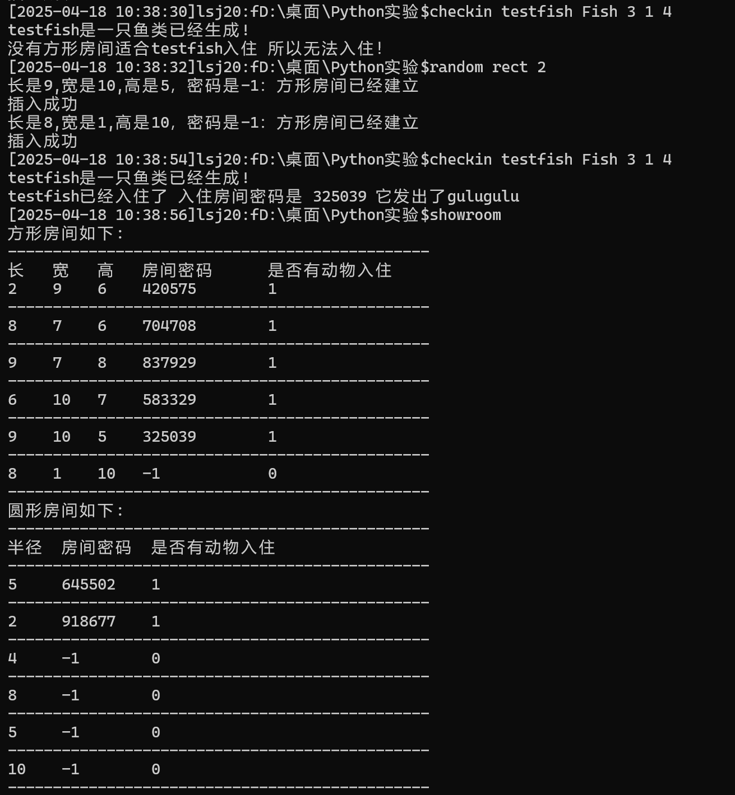

### 动物旅馆开发文档


#### ！更新
版本：v1.1
作者：LosAngelous
新增：本地文件存储(json)
功能展示:


#### 项目
项目名称：动物酒店管理系统
版本：v1.0
作者：LosAngelous

#### 项目功能
- 为5种动物发配房间
- 能够自行设定房间大小
- 根据动物生理要求设计
所有的动物（假设只有哺乳动物、鸟类动物、爬行动物、两栖动物和鱼类动物）也都具有长、宽、高尺寸。假设所有的哺乳动物大脑比较灵活，可以尽自己的能力调整身体以便进入房间（比如长方体房间是2*5*3，哺乳动物是3*2*4，可以入住）；鸟类动物只想住在球形房间内；而爬行动物、两栖动物和鱼类动物由于身体不便调整，只能前进或者后退，所以需要对应长宽高都要比动物大的房间（比如长方体房间是2*5*3，爬行或鱼类动物是3*2*4，则不可以入住）。
所有动物拿到可以入住的房间密码后，都会表示一下心情。哺乳动物会说：hahaha，鸟类动物会说：jiujiujiu，爬行动物会说：xixixi，两栖动物会说：guaguagua，鱼类动物会说：gulugulu。 
- 能够实现基础的动物管理系统shell功能

#### 参考资料
- deepseek 相关资料
- Chatgpt 相关资料

#### 类的设计
项目入口: Main.py
Hotel：管理房间和动物的入住、退房
Animal：表示动物的属性和行为
Room (RectRoom & CircleRoom)：表示不同类型的房间
PassWord：生成和管理房间密码
PythonShellForAnimal：提供命令行界面与用户交互
Common：存放枚举类和全局映射

#### 扩展shell设计

```shell
      addrect <x(int)> <y(int)> <z(int)> <id(int)>
        添加方形房间

      addcircle <r(int)> <id(int)>
        添加圆形房间

      droom <animal_name(str)>
        删除动物房间  
        
      checkin <animal_name(str)> <kind(str)> <x(int)> <y(int)> <z(int)>
        动物入住

      checkout <animal_name(str)>
        动物退房

      showani
        显示所有动物

      showkind
        显示种类名称
        
      showcroom 
      showrroom 
      showroom
        显示圆形/方形房间类型
        
      random circle <num(int)>
      random rect <num(int)>
        随机生成若干房间
        
      help
        显示帮助信息
        
      clear
        清理屏幕

      exit
        退出Shell
```

#### 运行截图
- 显示


- 插入


- 删除


- UI界面
